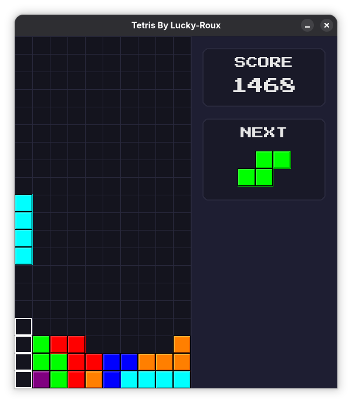
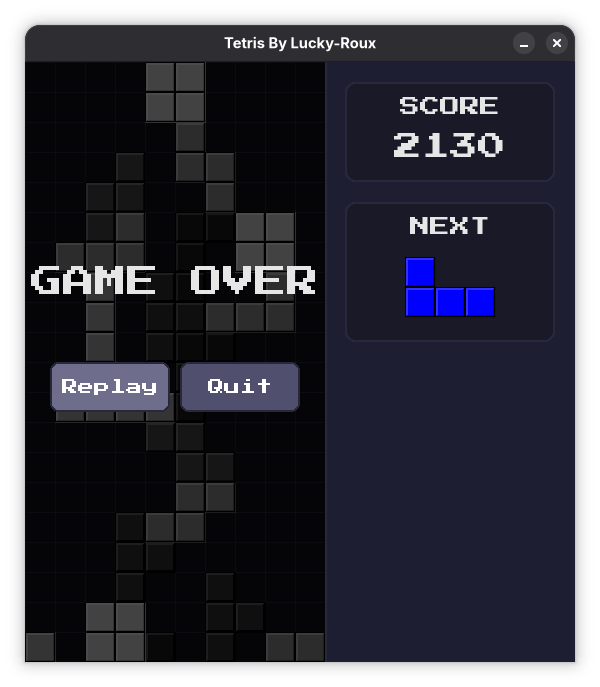

# 🧱 Neon Stack: Tetris in Pygame 🎮

Fast, colorful, and satisfyingly crunchy. This is a modern-feel Tetris build in Python with smooth falling interpolation, ghost projection, particle effects, and a clean side panel for score + next piece planning.

If you like classic mechanics with a little arcade polish, this one is for you.

<table>
	<tr>
		<td></td>
		<td></td>
	</tr>
</table>

## ✨ What Makes It Fun

- 🎯 Classic 10x20 Tetris ruleset with responsive movement.
- 🎲 7-bag randomizer for fair piece distribution.
- 👻 Ghost piece preview so you can read drops instantly.
- ⚡ Soft drop and sonic hard drop with score bonus.
- 💥 Line clear flash + shatter particles for feedback.
- 🔮 Next piece preview panel.
- ⏸️ Pause menu and game over menu with mouse-click buttons.
- 🔊 Background music + SFX with graceful fallback if a file is missing.

## 🧠 Gameplay Notes

- Board size: `10 x 20`
- Default fall speed: `500 ms / row`
- Soft drop speed: `50 ms / row`
- Sonic drop speed: `10 ms / row`

### 🏆 Scoring

| Action | Points |
|---|---:|
| Single line clear | 100 |
| Double line clear | 300 |
| Triple line clear | 500 |
| Tetris (4 lines) | 800 |
| Sonic drop bonus | `2 x cells dropped` |

## 🎮 Controls

- Left Arrow: Move left
- Right Arrow: Move right
- Up Arrow: Rotate clockwise
- Down Arrow (hold): Soft drop
- Space: Sonic hard drop
- P: Pause / resume
- Mouse: Click buttons in pause/game-over overlays

## 🚀 Quick Start

### 1) Clone

```bash
git clone https://github.com/Lucky-Roux-007/Tetris.git
cd Tetris
```

### 2) Install dependency

```bash
pip install -r requirements.txt
```

### 3) Run

```bash
python tetris.py
```

## 📦 Requirements

- Python 3.9+
- `pygame-ce==2.5.7`

## 🗂️ Project Layout

```text
.
├── README.md
├── requirements.txt
├── src
│   ├── background.mp3
│   ├── drop.wav
│   ├── line_clear.wav
│   ├── PressStart2P-Regular.ttf
│   └── rotate.wav
└── tetris.py
```

## 🎵 Audio and Asset Fallbacks

The game will still run if optional sound files are missing or fail to load. You may lose specific effects, but gameplay remains intact.

## 💎 Why This Version Feels Good

The piece movement uses visual interpolation so drops look smooth without sacrificing tight logic timing. Combined with ghost projection and particle feedback, the game keeps the clarity of classic Tetris while feeling more alive frame-to-frame.

## 🛠️ Future Ideas

- 🧤 Hold piece mechanic
- 📈 Level progression tied to lines cleared
- 🥇 High score persistence
- 🔄 Wall-kick rotation system

